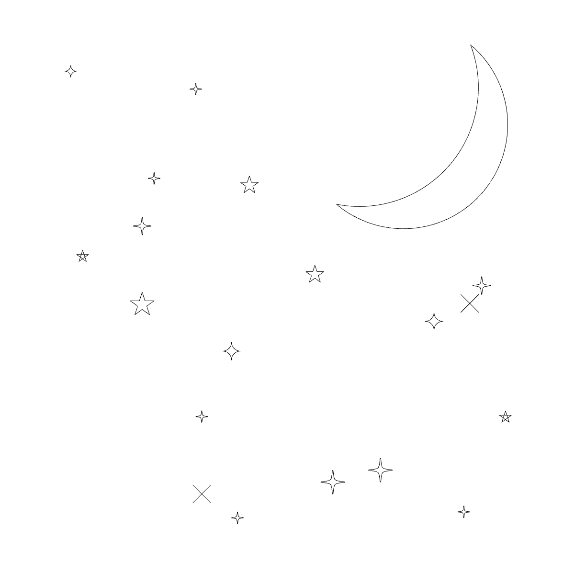
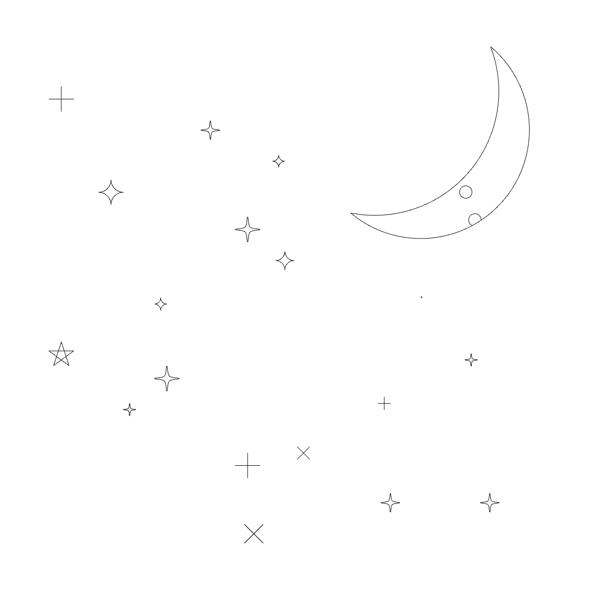
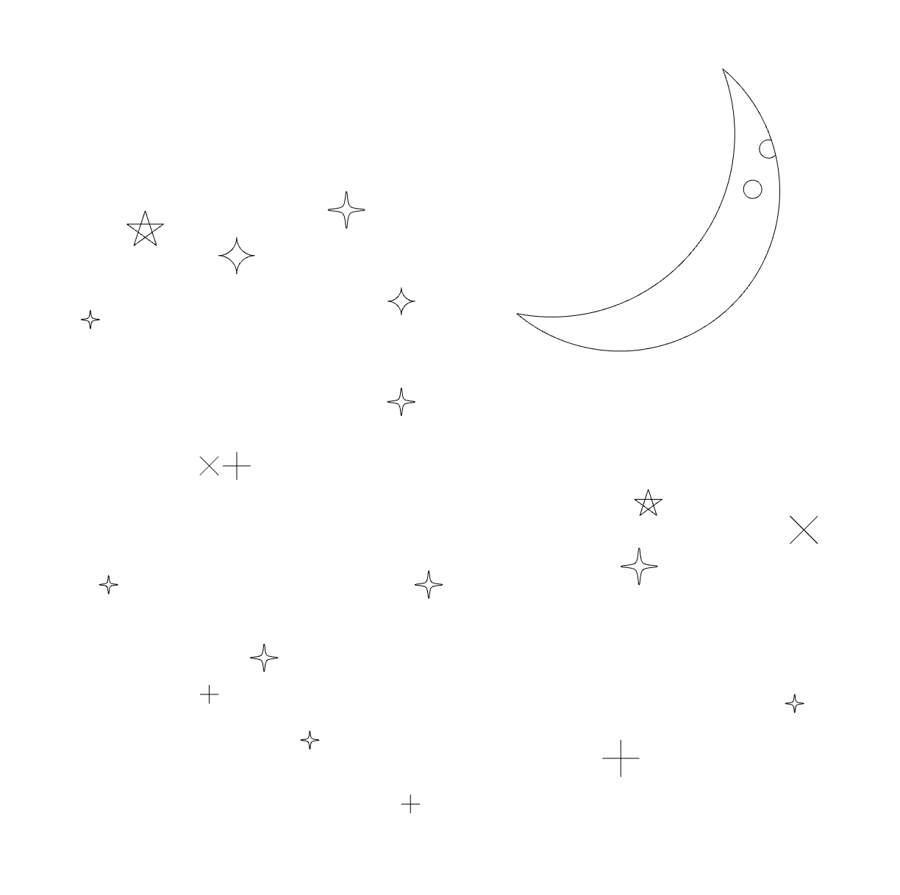

    
    <h1>Nightsky</h1>
    

        <b>A starry night. Now on your <a href="https://hackclub.com/blot">Blot!</a></b>
    

    

        
        
        
        
    

     
     
     

## Usage

Copy the contents of [index.js](https://github.com/khrj/nightsky/blob/main/index.js) to [the Blot editor ↗](https://blot.hackclub.com/editor)

There's 6 types of stars, the

- simpleStar
- crossStar
- classicStar
- classicStarUnfilled
- curveStar, and
- arcStar

Counts for each can be configured at the top of `index.js`. You can change if you want craters on the moon and if you want to rotate the stars, also at the top of `index.js`

## More screenshots

